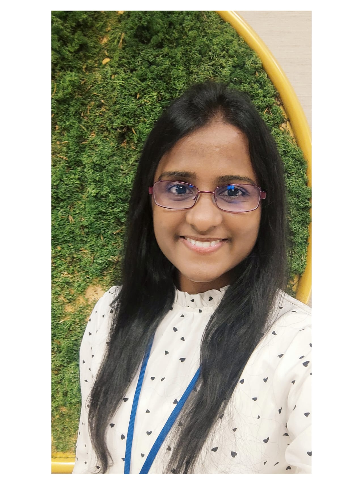

<html lang="en">
<head>
    <meta charset="UTF-8">
    <meta name="viewport" content="width=device-width, initial-scale=1.0">   
    <title>Chamani Shiranthika</title>
    
</head>
<body>
    

        

            
            
Research Assistant | Teaching Assistant | Ph.D. Student | Former Software Engineer

        

        <section id="about" class="content">
            <h2>About Me</h2>
            
I am a PhD student in Engineering Science at Simon Fraser University, BC, Canada. I am an energetic, dedicated, and hardworking individual in the research and academics field. I would like to gain research experience while achieving professional goals and be a valuable asset to the world. Researching novel Artificial Intelligence milestones, solving human life problems with new techniques, and trying to facilitate human beings are my life targets.

        </section>
        
        <section id="education" class="content">
            <h2>Education</h2>
            <ul>
            <li>
<strong>Ph.D. in Engineering Science (Reading), Simon Fraser University, Burnaby, BC, Canada (2022 Spring-ongoing)</strong>
</li>
            
CGPA – 3.67/4.0

            
Researching on Federated Learning, Collaborative Intelligence, Medical Imaging, Compression in Split Federated networks.

            <li>
<strong>M.Sc. in Electrical Engineering, National Taipei University, Taiwan (2019 -2021)</strong>
</li>
            
GPA - 4.0/4.0

            
Received the “Falcon award for character and academic excellence” by the National Taipei University.

            
Thesis: Reinforcement Learning based Control of Cancer Chemotherapy Treatments.

            
Received the 'Best Master Thesis Award' from the IEEE Taipei Section.

            <li>
<strong>B.Sc. Honors in Information Technology, University of Moratuwa, Sri Lanka (2014 - 2018)</strong>
</li>
            
First Class Honors (GPA - 3.74/4.2)

            
Thesis: Machine-Learning approach for Personalized Travel spots recommendation for tourists.

            <li>
<strong>Advanced Diploma in Management Accountants, Chartered Institute of Management Accountants (CIMA UK) (2012 – 2014)</strong>
</li>
            
Advanced diploma completing 3 tiers of Foundational Level, Operational Level, Management Level.

            
Devi Balika Vidyalaya, Colombo 08, Sri Lanka. (2003 - 2012)

            <ul>
                <li>G.C.E Advanced Level Examination 2012 (Mathematics Stream)</li>
                Results – Combined Mathematics-A, Chemistry-B, Physics-B
                <li>G.C.E Ordinary Level Examination 2008 (English Medium)</li>
                Results – 6A’s, 2B’s 1C’s
            </ul>
                
            </ul>
            </section>
        <section id="work" class="content">
            <h2>Work Experience</h2>
            <h3>Software Engineer</h3>
            <ul><li>
            
WSO2Telco (Pvt) Ltd (Apigate SriLanka) (June 2018 - August 2019)
</li>
            </ul>
            <h3>Trainee Software Engineer</h3>
            <ul> <li>
            
Aspitio (Pvt) Ltd, Sri Lanka (June 2017 - August 2017)
</li>
           <li> 
Virtusa (Pvt) Ltd, Sri Lanka (December 2016 - June 2017)
 </li>
                </ul>
        </section>
        <section id="research" class="content">
            <h2>Research Experience</h2>
            <ul>
                <li>Collaborative Intelligence on Medical Imaging – Ongoing research project at Simon Fraser University. </li>
                <li>Reinforcement Learning based Chemotherapy modeling approach - Research project between National Taipei University, Taiwan and Cheng Hsin General Hospital, Taipei, Taiwan. This research is being done with Data Driven (Off-line/ Batch) Reinforcement Learning algorithms using real human colon cancer data collected from the Cheng-Hsin General Hospital, Taipei, Taiwan. </li>
                <li>An evaluation of the Five Times Sit-to-Stand Test (FTSST) in older adults for frailty detection - Research project between National Taipei University, Taiwan and Taipei Medical University, Taiwan.</li>
                <li>Improvements on the Sequential Minimal Optimization (SMO) on Support Vector Regression (SVR) - Research project</li>
                <li>Personalized location recommendation and location details translation- A tour guide system based on Artificial Intelligence.</li>
                <li> Peer reviewing in the following research conferences, and journals.
-	ICITR 2019 (2 papers), ICPRAM 2019 (1 paper), ICIPRoB 2020 (1 paper), ICITR 2020 (5 papers), ICITR 2021 (4 papers), ICASSP 2023 (1 paper), CVPR-WiCV 2023 (2 papers), CVPR-WiCV 2024 (3 papers), Computers and Electrical Engineering Journal (1 paper)
</li>
            </ul>
        </section>
        <section id="teaching" class="content">
            <h2>Teaching Experience</h2>
            <table>
                <thead>
                    <tr> 
                        <th><b>Subject</b></th>
                        <th><b>Institution</b></th>
                        <th><b>Professor In Charge</b></th>
                        <th><b>Term</b></th> 
                    </tr>
                </thead>
                <tbody>
                    <tr>
                        <td>Microelectronics</td>
                        <td>Simon Fraser University, Canada</td>
                        <td>Prof. Ash Parameswaran</td>
                        <td>2024 Summer</td>
                    </tr>
                    <tr>
                        <td>Digital/ Medical Image Processing</td>
                        <td>Simon Fraser University, Canada</td>
                        <td>Prof. Parvaneh Saeedi</td>
                        <td>2024 Spring</td>
                    </tr>
                    <tr>
                        <td>Microelectronics</td>
                        <td>Simon Fraser University, Canada</td>
                        <td>Prof. Majid Shokoufi</td>
                        <td>2023 Fall</td>
                    </tr>
                    <tr>
                        <td>Microelectronics</td>
                        <td>Simon Fraser University, Canada</td>
                        <td>Prof. Majid Shokoufi</td>
                        <td>2023 Summer</td>
                    </tr>
                    <tr>
                        <td>Microelectronics</td>
                        <td>Simon Fraser University, Canada</td>
                        <td>Prof. Majid Shokoufi</td>
                        <td>2022 Summer</td>
                    </tr>
                    <tr>
                        <td>Control Systems</td>
                        <td>National Taipei University, Taiwan</td>
                        <td>Prof. Chan Yun Yang</td>
                        <td>2019 Fall</td>
                    </tr>
                     <tr>
                        <td>Probability and Statistics</td>
                        <td>National Taipei University, Taiwan</td>
                        <td>Prof. Chan Yun Yang</td>
                        <td>2020 Summer</td>
                    </tr>
                     <tr>
                        <td>Machine Learning</td>
                        <td>National Taipei University, Taiwan</td>
                        <td>Prof. Chan Yun Yang</td>
                        <td>2020 Summer</td>
                    </tr>
                     <tr>
                        <td>Practical sessions on Exploratory Data Analytics</td>
                        <td>National Taipei University, Taiwan</td>
                        <td>Prof. Chan Yun Yang</td>
                        <td>2020 Summer</td>
                    </tr>                
                </tbody>
            </table>
        </section>
        <section id="interests" class="content">
            <h2>Research Interests</h2>
            <ul>
                <li>Federated Learning</li>
                <li>Collaborative Intelligence</li>
                <li>Medical Image Analysis</li>
                <li>Compression in Split-Federated Learning</li>
                <li>Explainable Artificial Intelligence (XAI)</li>
            </ul>
        </section>
        <section id="publications" class="content">
            <h2>Publications</h2>
            <h3>Conferences</h3>
    <ol>
        <li>“SplitFed resilience to packet loss: Where to split, that is the question”
            <b>Chamani Shiranthika<b>, Zahra Hafezi Kafshgari, Parvaneh Saeedi, Ivan Bajic
            4th MICCAI 2023 Workshop on Distributed, Collaborative and Federated Learning 2023, Vancouver, BC, Canada.
        </li>
        <li>“Quality-Adaptative Split-Federated Learning for segmenting medical images with inaccurate annotations”
            Zahra Hafezi Kafshgari, Chamani Shiranthika, Parvaneh Saeedi, Ivan Bajic
            IEEE International Symposium on Biomedical Imaging (ISBI) 2023, Columbia.
        </li>
        <li>“Personalized Travel spots Recommendation based on unsupervised learning approach”
            C. Shiranthika, N. Premakumara, S. Fernando and S. Sumathipala
            "Personalized Travel Spot Recommendation based on Unsupervised Learning Approach," 2018 18th International Conference on Advances in ICT for Emerging Regions (ICTer), 2018, pp. 229-234, doi: <a href="https://doi.org/10.1109/ICTER.2018.8615533" target="_blank">10.1109/ICTER.2018.8615533</a>.
        </li>
        <li>“Application of Summarization and Sentiment Analysis in the Tourism Domain”
            N. Premakumara, C. Shiranthika, P. Welideniya, C. Bandara, I. Prasad and S. Sumathipala
            "Application of Summarization and Sentiment Analysis in the Tourism domain," 2019 IEEE 5th International Conference for Convergence in Technology (I2CT), 2019, pp. 1-5, doi: <a href="https://doi.org/10.1109/I2CT45611.2019.9033569" target="_blank">10.1109/I2CT45611.2019.9033569</a>.
        </li>
        <li>“Personalized Travel spots recommendation and guidance system for Sri Lankan tourists”
            C. Shiranthika, N. Premakumara, J. Weerawarnakula, H. Lakmal, S. Fernando, and S. Sumathipala
            “Personalized Travel Spot Recommendation and Guidance System for Sri Lankan Tourists,” in Proceedings of the 11th International Research Conference, Kothalawala Defence University, Sri Lanka, pp. 121–129. [Online]. Available: <a href="http://ir.kdu.ac.lk/handle/345/2498" target="_blank">http://ir.kdu.ac.lk/handle/345/2498</a>.
        </li>
        <li>“An Advanced Vehicle Warning System to Prevent Road Accidents”
            C. Shiranthika, N. Premakumara, J.K.C. Shyalika, S. Bandara, S. Sumathipala, and C.Y. Yang
            “An Advanced Vehicle Warning System to Prevent Road Accidents,” in 16th International Conference on Automation Technology 2019 (Nov 22-24), Taipei, Taiwan.
        </li>
        <li>“Integration of Speech Recognition with Computer Assisted Translation”
            C. Shiranthika and S. Sumathipala
            in 6th International Conference on Advancement of Development Administration (NIDA), Bangkok, Thailand.
        </li>
        <li>“Human Activity Recognition using CNN and LSTM”
            C. Shiranthika, N. Premakumara, H.L. Chiu, H. Samani, C. Shyalika and C.Y. Yang
            "Human Activity Recognition Using CNN & LSTM," 2020 5th International Conference on Information Technology Research (ICITR), 2020, pp. 1-6, doi: <a href="https://doi.org/10.1109/ICITR51448.2020.9310792" target="_blank">10.1109/ICITR51448.2020.9310792</a>.
        </li>
        <li>“IoT enabled Open framework for air pollution monitoring system”
            B.H. Sudantha, M.A.L.S.K, N. Premakumara, C. Shiranthika, C. Premachandra and H. Kawanaka
            "IoT Enabled an Open Framework for Air Pollution Monitoring System," 2020 5th International Conference on Information Technology Research (ICITR), 2020, pp. 1-5, doi: <a href="https://doi.org/10.1109/ICITR51448.2020.9310838" target="_blank">10.1109/ICITR51448.2020.9310838</a>.
        </li>
        <li>“An evaluation of the Five Times Sit-to-Stand Test (FTSST) in older adults for frailty detection”
            H. L. Chiu, C.AChen, N. Premakumara, C. Shiranthika, C.Y Yang
            "An evaluation of the Five Times Sit-to-Stand Test (FTSST) in older adults for frailty detection," 2020 14th International Convention on Rehabilitation Engineering and Technology (iCREATe), 2020, Taipei, Taiwan.
        </li>
    </ol>

            <h3>Journals</h3>
    <ol>
        <li>“Decentralized Learning in Healthcare: A Review of Emerging Techniques”
            C. Shiranthika, P. Saeedi and I. V. Bajić, in IEEE Access, vol. 11, pp. 54188-54209, 2023, doi: <a href="https://doi.org/10.1109/ACCESS.2023.3281832" target="_blank">10.1109/ACCESS.2023.3281832</a>.
        </li>
        <li>“Supervised Optimal Chemotherapy Regimen based on Offline Reinforcement Learning”
            C. Shiranthika, Kuo-Wei Chen, Chung-Yih Wang, Chan-Yun Yang, B. H. Sudantha, Wei-Fu Li, in IEEE Journal of Biomedical and Health Informatics. 2022;26(9):4763-4772. doi: <a href="https://doi.org/10.1109/JBHI.2022.3183854" target="_blank">10.1109/JBHI.2022.3183854</a>.
        </li>
        <li>“Development of gravitationally aligned pendant IMU frailty identifier”
    Chan-Yun Yang, Nilantha Premakumara, Huei-Ling Chiu, Yao-Hung Feng, Tzu-Ying Chen, Chamani Shiranthika, in Computers and Electrical Engineering (2024);118: 109466
</li>
        <li>“Realtime Computer Vision-Based Accurate Vehicle Counting and Speed Estimation for Highways”
            C. Shiranthika, P. Premaratne, Z. Zheng, and B. Halloran, in Intelligent Computing Theories and Application, pp. 583–592.
        </li>
        <li>“Reinforcement Learning Strategies in Cancer Chemotherapy Treatments: A Review”
            Chamani Shiranthika, Chan-Yun Yang, Kuo-Wei Chen, Chung-Yih Wang, Sagara Sumathipala, in Computer Methods and Programs in Biomedicine (2022): 107280.
        </li>
        </ol>
<h3>Posters</h3>
    <ol>
<li>“Optimizing Split Points for Error-Resilient SplitFed Learning”
    Chamani Shiranthika, P. Saeedi and I. V. Bajić, Research paper accepted for poster presentation, at the Women in Computer Vision (WiCV) workshop, at CVPR, 2024.
</li>
<li>“SplitFed resilience to packet loss: Where to split, that is the question”
    Chamani Shiranthika, P. Saeedi and I. V. Bajić, Poster presented at the CRA Grad Cohort for Woman 2024, held in Minneapolis, Minnesota, on April 11-13, 2024.
</li>
<li>“An Evaluation Of The Five Times Sit-to-stand Test In Older Adult For Frailty Detection”
    Chamani Shiranthika, Tsu-Ying Chen, Huei-Ling Chiu, Chan-Yun Yang, Taipei Union University System Academic Research Achievement Presentation, Taipei, Taiwan, 2021.
</li>
<li>“Reinforcement Learning Control for Cancer Chemotherapy Drug Dosing”
    Chamani Shiranthika, Guo-Wei Chen, Chong-Yi Wang, Wei-Fu Li, Chan-yun Yang, The 25th Taiwan Cancer Joint Academic Conference, Taipei, Taiwan, 2021.
</li>

   </ol>
        </section>
        
        <section id="awards" class="content">
            <h2>Awards & Scholarships</h2>
            <ul>
<li>PHD Research Scholarship - SFU
Received in the Fall 2023, Spring 2024, Summer 2024. 
</li>
<li>Graduate Fellowship- ENSC SFU
Received in Summer 2024. 
</li>
            
                <li>Best Master Thesis award 2021 – IEEE Taipei Section
The award for the Best Master thesis given by the IEEE Taipei Section, Nominated by the SMC Taipei Sector. 
</li>
                <li>Falcon award for character and academic excellence 
The special prize, which will be given to the Best student on the character and academic excellence in the Master’s student’s batch of the College of Electrical Engineering and Computer Science.
</li>
                <li>Dean's Honours List (During Bachelors Education at University of Moratuwa, Sri Lanka)
Level1 Sem1, Level1 Sem2, Level2 Sem1, Level3 Sem1, Level4Sem1.
</li>
                <li>Sri Lanka Olympiad Mathematics Competition 
2010 -Distinction Award
2011 - High Distinction Award
</li>
                <li>Australian National Chemistry Quiz
2008 - Distinction Award in junior section
2010 - High Distinction Award in senior section.</li>
                <li>FIT CodeRush 2016 coding competition, University of Moratuwa, Sri Lanka
15 from 60 teams.
</li>
 <li>Mora Extreme 1.0 2016, University of Moratuwa, Sri Lanka
21 from 68 teams
 </li>
 <li>All Island News Paper Quiz Competition - Sri Lanka Sustainable Energy Authority 
All Island 1st place - Presented a Energy Consumption Controlling Project for Households    

 </li>
            </ul>
        </section>
        
        
        <section id="voluntary" class="content">
            <h2>Voluntary Activities</h2>
            <ul>
<li>Pioneered in the fund raising program in renovating a computer lab in a rural school in Sri Lanka (https://www.gofundme.com/f/help-us-in-renovation-of-our-computer-lab) where the project was successfully finished on 2024 March 25. I was the main initiator of the project and carried out it successfully with the clarity organization: Sri Lanka Humanitarian Foundation of Canada, in Edmonton. </li>
<li>Mentor in the ScholarX program organized by the Sustainable Education Foundation, Sri Lanka https://sefglobal.org/scholarx/2022/, (2022 May– 2022 November). </li>
<li>Participated at the AIESEC SUMMER CAMP representing Sri Lanka, organized by the National Taipei University, Taiwan AIESEC Association for the High School students at Taiwan, (2020 July 14 – 2020 July 23). </li>
<li>Participated in a Tea Industry survey organized by the University of Moratuwa, Sri Lanka AIESEC GIP Association, for the tea industry companies at Sri Lanka. </li>
<li>Member of the Editorial Board of the Mora Mag Literature magazine and the Media Unit of University of Moratuwa, Sri Lanka, (2016 September – 2018 June). </li>
<li>Member of the Editorial Board of the Sinhala and English Literary Associations of Devi Balika Vidyalaya, Colombo 08, Sri Lanka, (2007 – 2010). </li>

            </ul>
        </section>
        <section id="qualifications" class="content">
            <h2>Professional Qualifications</h2>
            <ul>
<li>Certificate in Business Accounting (CIMA-Certificate Level) – 2013 May </li>
<li>Diploma in Management Accounting (CIMA-Operational Level) – 2014 January</li>
<li>Advanced Diploma in Management Accounting (CIMA-Management Level) – 2014 November</li>
<li>Microsoft Certified Azure AI Fundamentals – 2021 September</li>
<li>Reinforcement Learning Specialization certificate issued by University of Alberta, Canada – 2021 February</li>

            </ul>
        </section>
        <section id="memberships" class="content">
            <h2>Professional Memberships</h2>
            <ul>
<li>IEEE Graduate Student Membership </li>
<li>IEEE Women in Engineering Membership</li>
<li>IEEE Systems, Man, and Cybernetics Society Membership</li>
<li>IEEE Young Professionals Membership</li>

            </ul>
        </section>
        <section id="contact" class="content">
            <h2>Contact Information</h2>
            
Email: chamanijks2@gmail.com

LinkedIn: <a href="https://www.linkedin.com/in/chamani-shiranthika-76491994/">https://www.linkedin.com/in/chamani-shiranthika</a>

        </section>
    

    <footer>
        
&copy; 2024 Chamani Shiranthika. All rights reserved.

    </footer>
</body>
</html>
